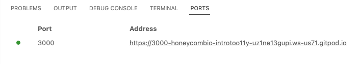

# Intro to Observability: Demo in Node.js

This Node.js application is here for you to try out tracing with Honeycomb.
It consists of a microservice that calls itself,
so you can simulate a whole microservice ecosystem with just one service!

Spoiler: this microservice implements the [Fibonacci sequence](https://en.wikipedia.org/wiki/Fibonacci_number).

## What to do

Recommended: 

[](https://gitpod.io/#https://github.com/honeycombio/intro-to-o11y-nodejs)

Gitpod is a free cloud environment where you can run the example without needing to clone the code or install Go on your machine.

You can also [run the app locally](#running-locally).

## Start the app

`./run`

### See the app

If you are running the app in Gitpod, navigate to the "Ports" tab and click the address for port 3000 to open the app in a new tab:



If you are running locally, access the app at [http://localhost:3000](http://localhost:3000)

Activate the sequence of numbers by selecting the **Go** button in the app.

After the app displays numbers, select **Stop**.

Try this a few times.

Maybe open the browser tools and notice how long each request takes.
Why does it get slower and slower?

Let's add tracing and find out!

### Stop the app

Push `Ctrl-C` in the terminal where the app is running.

## Configure tracing to connect to Honeycomb

This project has the tracing configuration set up in tracing.js.
See that the top line of `index.js` calls into `tracing.js` to activate this.

In `tracing.js`, the code refers to some environment variables.

You'll configure the app to send traces to Honeycomb by setting an `HONEYCOMB_API_KEY` environment variable.

[Log in to honeycomb](ui.honeycomb.io) and [get a Honeycomb API Key](https://docs.honeycomb.io/getting-data-in/api-keys/#find-api-keys).

The repo comes with an example env file you can copy to get started:

`cp .env.example .env`

Now edit the contents of `.env` to put in your API key. This file is ignored by git, so you
won't accidentally commit your API key.

```
export HONEYCOMB_API_KEY=<replace-this-with-a-real-api-key>
```

Stop the app, start it again, and click Go and Stop.

Head over to [Honeycomb](https://ui.honeycomb.io) for your data. Try clicking "Home" in the top left.
Where the dropdown says "All datasets in prod" (or whatever you named your environment), choose the `sequence-of-numbers` service.

Do you see some lines?

Scroll down for Recent Traces. Click into one of those. Do you see some spans?

## Part 2 of the workshop: Add a custom field

Let's make it easier to find that 'index' query parameter.

When we receive the request to `/fib`, we know that index is interesting data,
so add a field.

To get access to the current span, first import the OpenTelemetry API at the
top of `index.js` (this should be there already):

`const otel = require("@opentelemetry/api");`

Then, anywhere in that file, you can grab the current span and add attributes.
Find these lines commented out in the request handler, and uncomment them:

```js
const span = otel.trace.getSpan(otel.context.active());
span.setAttribute("parameter.index", index);
```

Test the app again, look at the traces, and find the new field you added.

### Advanced: Add a custom span

How long does the real calculation take?

At the beginning of the `calculateFibonacciNumber` function, create a custom span (or find this line and uncomment it)

`let span = tracer.startSpan("calculation");`

and then after the very exciting calculation, end it:

`span.end();`

Now see if you can spot the portion of your traces used for the real math!

## Running locally

Clone this repository.

If you use [VSCode devcontainers](https://code.visualstudio.com/docs/remote/containers-tutorial), open the directory in VSCode and choose "Reopen in container" when it offers. Or run the "Reopen in container" command.

Otherwise, you'll need Node.js 14+ and npm installed.

Either way, get to a shell prompt and:

```sh
npm install
npm run start
```

Then hit the application locally: http://localhost:3000

# Updating

Check the releases page for [opentelemetry-js](https://github.com/open-telemetry/opentelemetry-js/releases) and [opentelemetry-js-contrib](https://github.com/open-telemetry/opentelemetry-js-contrib/releases) for clues. You can also visit each package's page on [npmjs.com](https://www.npmjs.com/package/@opentelemetry/exporter-trace-otlp-grpc).

Update versions in `package.json` to match, and then try it.
